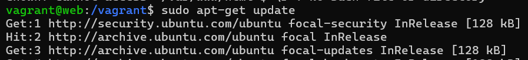
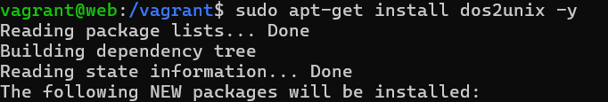
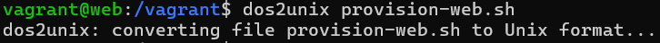
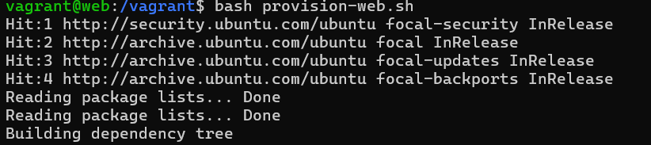
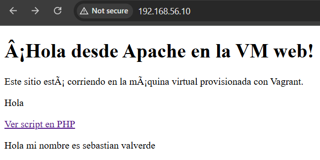
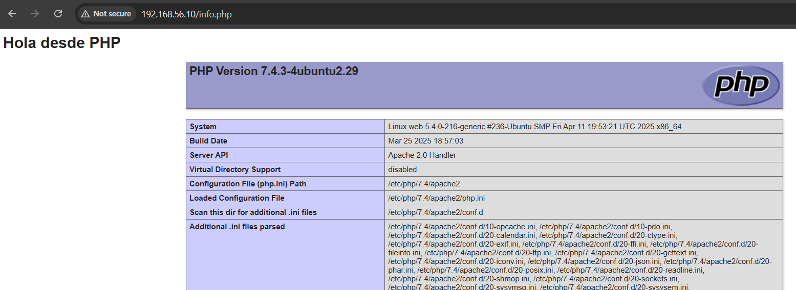
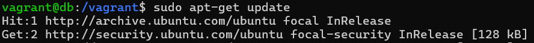
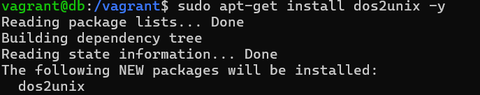
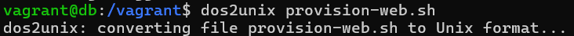
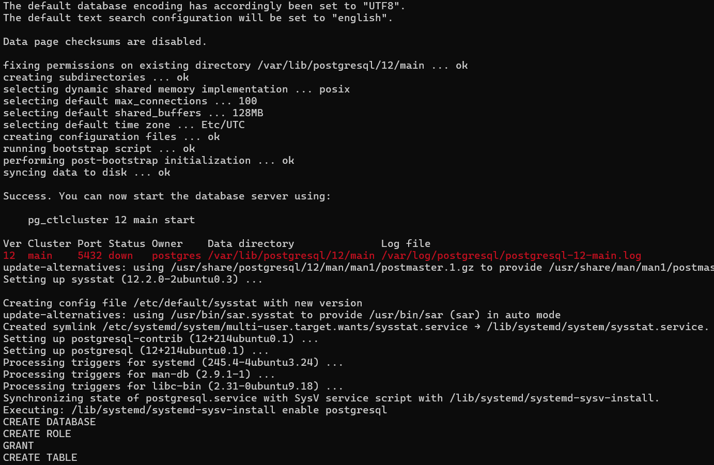

# Taller Vagrant + Provisionamiento con Shell

## Pasos
1. Clonar este repositorio.
2. Ejecutar `vagrant up` para levantar las máquinas.
3. Acceder a la máquina web en: http://192.168.56.10
4. Verificar `index.html` y `info.php`.

## Reto
- Completar `provision-db.sh` para instalar PostgreSQL.
- Crear una base de datos y tabla.
- Conectar la página PHP a la base de datos y mostrar datos.

## Evidencias WEB

- Se actualiza el ubunto con el siguiente comando 
> sudo apt-get update

- Luego se instala dos2unix
> sudo apt-get install dos2unix -y

- Convertimos el archivo porque sino nos sale unos errores por lo que el archivo fue creado en Windows 
> dos2unix provision-web.sh

- Por ultimo ejecutamos 
> bash provision-web.sh

- Observamos el resultado web

- Validamos el archivo info.php

## Evidencias DB

- Se actualiza el ubunto con el siguiente comando 
> sudo apt-get update

- Luego se instala dos2unix
> sudo apt-get install dos2unix -y

- Convertimos el archivo porque sino nos sale unos errores por lo que el archivo fue creado en Windows 
> dos2unix provision-web.sh

- Por ultimo ejecutamos 
> bash provision-web.sh

- Observamos el resultado web

- Validamos el archivo info.php

